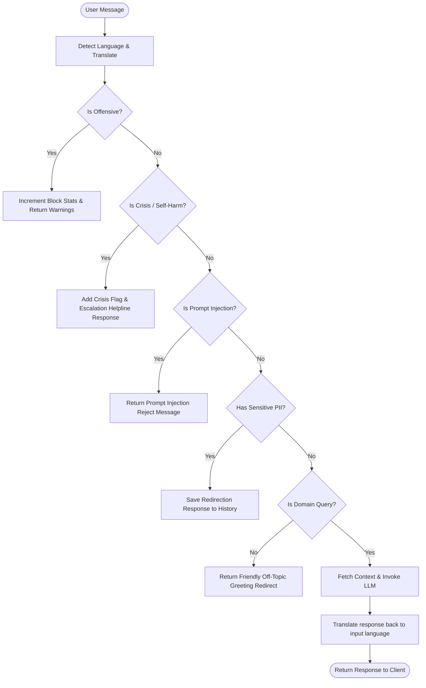

# 🌟 MindSpace Chatbot

MindSpace is a secure, high-concurrency, and ethically aligned mental wellness companion chatbot. It is designed to engage users in warm, empathetic conversations while enforcing strict domain controls, crisis safety redirections, and session persistence.

Built with **FastAPI**, **LangChain**, and **Anthropic Claude 3.5**, it is fully hardened for production deployment.

---

## 🚀 Key Features

*   **Empathy-Driven Dialogues:** Natural conversations supporting **English, Hindi, Marathi, and Hinglish** with dynamic context memory.
*   **Safety Guardrails:** 
    *   *Crisis Escalation:* Scans inputs for self-harm intent and immediately redirects users to verified national helpline contacts.
    *   *Offensive Content Blocking:* Intercepts profanity or abusive language before it reaches the LLM context.
    *   *Sensitive Data Redirect:* Detects personal identifiers (Aadhaar, PAN, passports, credit cards) and prevents ingestion.
*   **Scale-Ready Session Memory:** Core session management that saves memory logs to local JSON files for local development, with an optional fallback to a **Redis cache** for multi-instance production clustering.
*   **Hardened Concurrency:** Synced routes running on background thread pools to protect the FastAPI event loop from stalling under load.
*   **API Security:** Endpoints are locked down using HTTP Bearer Token authentication and secure CORS validation.

---

## 📁 Project Structure

```text
MindSpace_Bot/
├── .env                       # Local environment secrets and parameters
├── .gitignore                 # Files excluded from Git tracking
├── Dockerfile                 # Multi-stage production container instructions
├── docker-compose.yml         # Container orchestrator linking the API and Redis DB
├── requirements.txt           # Declared Python dependencies
├── config.py                  # Environment variable parser and settings constants
├── api.py                     # FastAPI server endpoints, security, and lifespan
├── main.py                    # CLI terminal interface and conversation flow manager
├── conversation_memory.py     # Memory storage and session logic
├── domain_guardrail.py        # Safety regex patterns and off-topic filters
├── language_support.py        # Language detection and translation helpers
├── prompts.py                 # Core system prompts and personality templates
└── safe_response.py           # Supportive crisis response and helpline templates
```

---

## 🛠️ Installation & Setup

### Prerequisites
*   Python 3.11 or higher
*   An [Anthropic API Key](https://console.anthropic.com/)
*   Docker & Docker Compose (optional, for containerized execution)

### 1. Clone & Initialize
Open your terminal in the root project directory:

```bash
# Initialize a virtual environment
python -m venv myenv

# Activate the virtual environment
# On Windows:
myenv\Scripts\activate
# On Linux/macOS:
source myenv/bin/activate

# Install dependencies
pip install -r requirements.txt
```

### 2. Configure Environment Variables
Create a file named `.env` in the root directory and add the following settings:

```bash
# Core API Keys
ANTHROPIC_API_KEY="your-anthropic-api-key-here"
CONVERSATIONAL_BOT_API_KEY="your-secure-bearer-api-token-here"

# Server Settings
API_HOST=127.0.0.1
API_PORT=8015
WORKERS=9                 # Number of workers, recommended calculation: (2 * CPU Cores) + 1
API_RELOAD=false          # Set to true for live code updates during local development

# Redis Cache Settings (Optional - Staging/Production)
USE_REDIS=false           # Set to true when deploying with Redis
REDIS_HOST=localhost
REDIS_PORT=6379
```

---

## 🎮 Running the Chatbot

### Option A: Interactive CLI (Local Development)
To test the chatbot personality directly in your terminal:

```bash
python main.py
```
*Useful commands inside the CLI:*
*   `clear`: Resets active session conversation history.
*   `reset`: Resets active session history and forgets your user name.
*   `stats`: Displays session logs, detected language, and block statistics.
*   `exit`: Exits the program safely.

### Option B: Local API Server
To start the FastAPI server locally:

```bash
python api.py
```
Once launched, you can access:
*   **Swagger API Docs:** `http://localhost:8015/docs`
*   **Health Check:** `http://localhost:8015/health`

### Option C: Docker Compose (Production Staging)
To build and run the API server alongside a Redis session store container:

```bash
docker compose up --build
```
This automatically maps port `8015` on your host machine to the running API container.

---

## 📡 API Reference

All requests to private endpoints (`/api/*`) require the bearer token header configured in your `.env` file under `CONVERSATIONAL_BOT_API_KEY`:

```http
Authorization: Bearer <your_conversational_bot_api_key>
```

### 1. Send Chat Message
*   **Endpoint:** `POST /api/chat`
*   **Headers:**
    *   `Authorization: Bearer <API_KEY>`
    *   `Content-Type: application/json`
*   **Request Body:**
    ```json
    {
      "message": "I'm feeling very stressed today",
      "session_id": "optional_existing_session_id"
    }
    ```
*   **Response Body:**
    ```json
    {
      "response": "I hear you. Stress is heavy... What's been going on?",
      "session_id": "session_20260701_143000_abc123",
      "message_id": "msg_20260701_143005_xyz456",
      "timestamp": "2026-07-01T14:30:05.123456",
      "is_crisis": false,
      "is_offensive": false,
      "language": "en",
      "user_name": null
    }
    ```

### 2. Create Session
*   **Endpoint:** `POST /api/session`
*   **Request Body:**
    ```json
    {
      "user_id": "optional_user_id"
    }
    ```

### 3. Get Session Stats
*   **Endpoint:** `GET /api/session/{session_id}/stats`

### 4. Delete Session
*   **Endpoint:** `DELETE /api/session/{session_id}`

---

## 🛡️ Guardrail Architecture Flow

When a user submits a message, it undergoes the following verification lifecycle:


